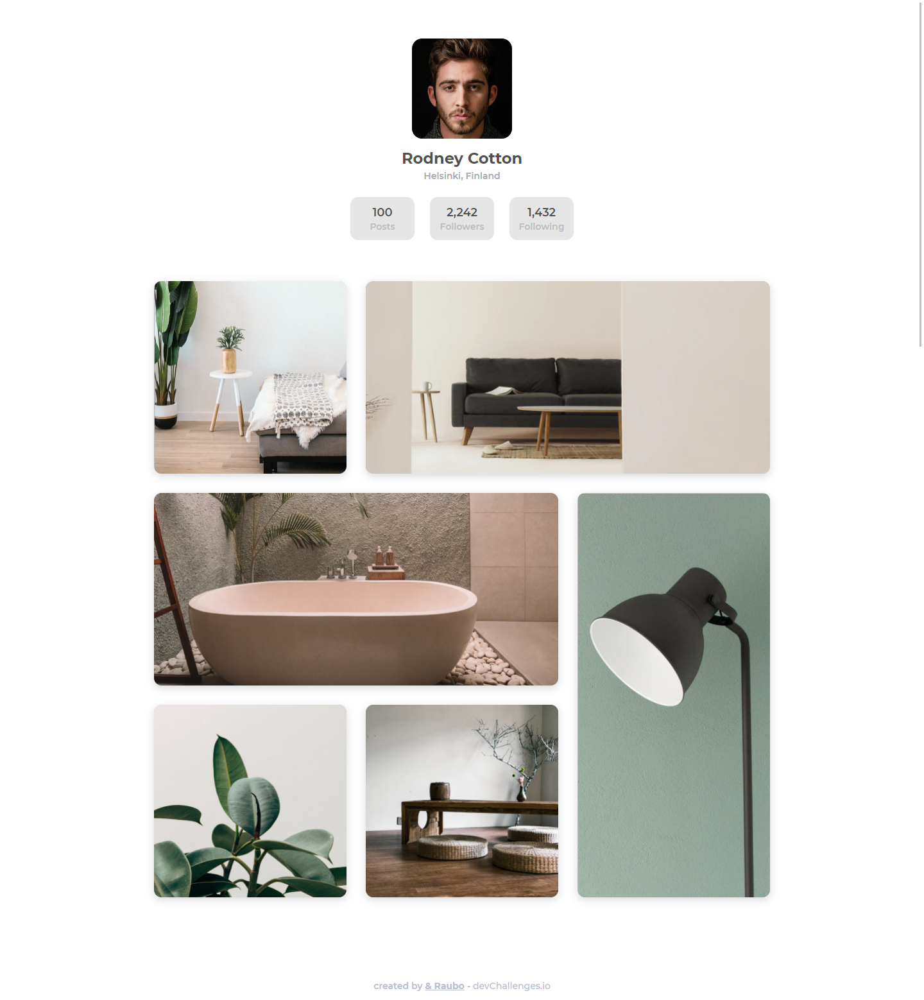
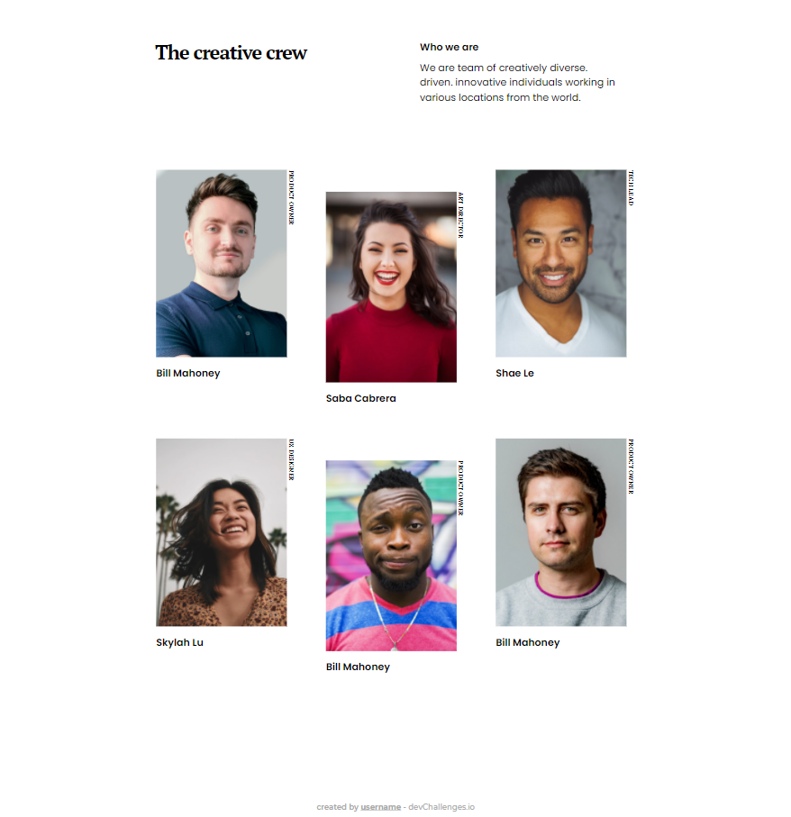
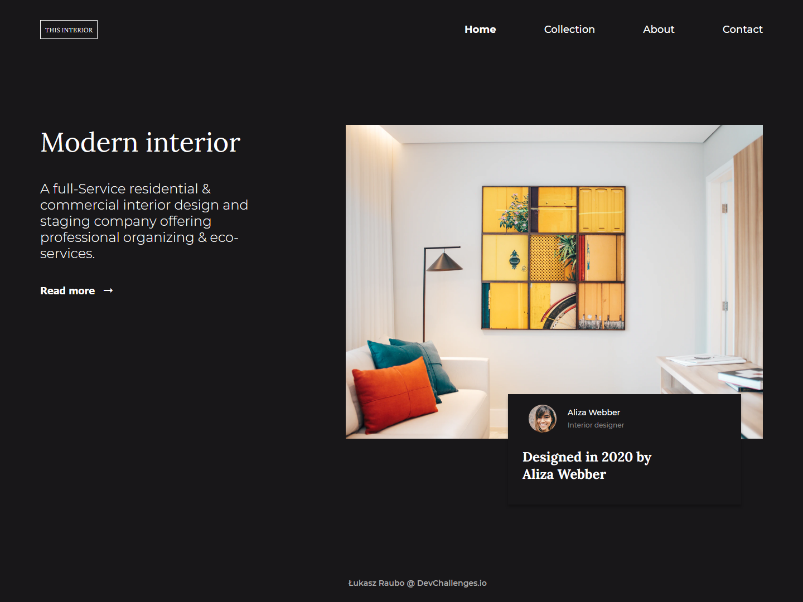
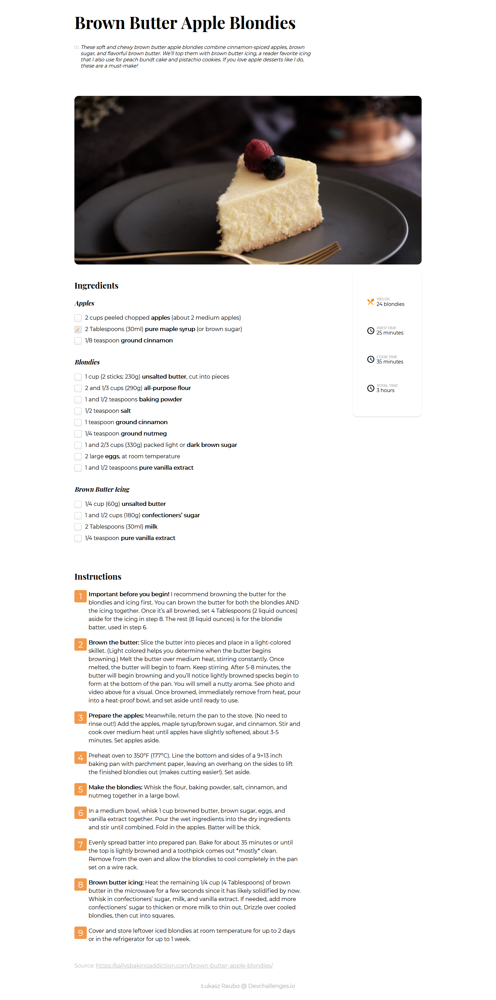
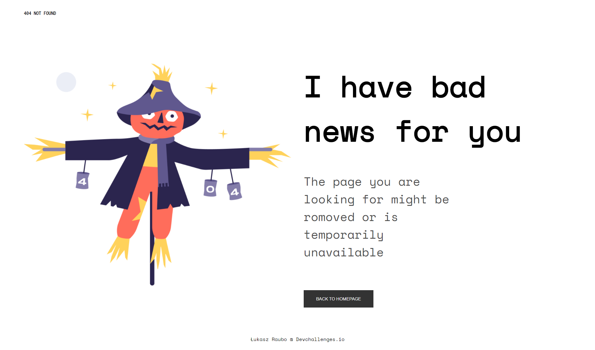

# Table of Contents
###### 0
- [Gallery](#1)
- [Team page](#2)
- [Interior consultant](#3)
- [Recipe page](#4)
- [404 Not Found](#5)
- [Contact](#Contact)
- [About](#About)

 

###### 1
<h1 align="center" id="myTeamPage">Gallery</h1>

<a href="#0">Top ↑</a>

  <h3>
    <a href="https://furtive-flower.surge.sh/">
      Demo
    </a>
     | 
    <a href="https://github.com/RauboLuk/devchallenges.io/tree/master/my-gallery-master">
      Solution
    </a>
     | 
    <a href="https://devchallenges.io/challenges/gcbWLxG6wdennelX7b8I">
      Challenge
    </a>
  </h3>

## Screenshot

  

###### 2
<h1 align="center" id="myTeamPage">Team page</h1>

<a href="#0">Top ↑</a>

  <h3>
    <a href="https://scrawny-ray.surge.sh/">
      Demo
    </a>
     | 
    <a href="https://github.com/RauboLuk/devchallenges.io/tree/master/my-team-page-master">
      Solution
    </a>
     | 
    <a href="https://devchallenges.io/challenges/hhmesazsqgKXrTkYkt0U">
      Challenge
    </a>
  </h3>

## Overview

  

###### 3
<h1 align="center" id="myTeamPage">Interior consultant</h1>

<a href="#0">Top ↑</a>

  <h3>
    <a href="http://uninterested-maid.surge.sh/">
      Demo
    </a>
     | 
    <a href="https://github.com/RauboLuk/devchallenges.io/tree/master/interior-consultant-master">
      Solution
    </a>
     | 
    <a href="https://devchallenges.io/challenges/Jymh2b2FyebRTUljkNcb">
      Challenge
    </a>
  </h3>

## Overview

  

###### 4
<h1 align="center" id="myTeamPage">Recipe page</h1>

<a href="#0">Top ↑</a>

  <h3>
    <a href="https://cloistered-dust.surge.sh/">
      Demo
    </a>
     | 
    <a href="https://github.com/RauboLuk/devchallenges.io/tree/master/recipe-page-master">
      Solution
    </a>
     | 
    <a href="https://devchallenges.io/challenges/OEKdUZ6xs0h99C38XVht">
      Challenge
    </a>
  </h3>

## Overview

  

###### 5
<h1 align="center" id="myTeamPage">404 Not Found</h1>

<a href="#0">Top ↑</a>

  <h3>
    <a href="https://aware-island.surge.sh/">
      Demo
    </a>
     | 
    <a href="https://github.com/RauboLuk/devchallenges.io/tree/master/404-not-found-master">
      Solution
    </a>
     | 
    <a href="https://devchallenges.io/challenges/wBunSb7FPrIepJZAg0sY">
      Challenge
    </a>
  </h3>

## Overview

  

# Contact

<a href="#0">Top ↑</a>

- GitHub [@RauboLuk](https://github.com/RauboLuk)
- Stack Overflow [@RauboLuk](https://stackoverflow.com/users/9185799/rauboluk)

 

## About
Pages above are solutions to a challenges from  <a href="http://devchallenges.io" target="_blank">Devchallenges.io</a>.