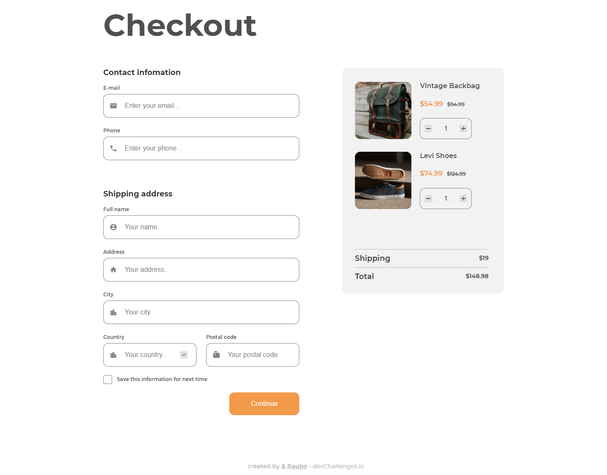

<!-- Please update value in the {}  -->

<h1 align="center">Checkout page</h1>

   Solution for a challenge from  <a href="http://devchallenges.io" target="_blank">Devchallenges.io</a>.

  <h3>
    <a href="https://amused-chain.surge.sh/">
      Demo
    </a>
     | 
    <a href="https://github.com/RauboLuk/devchallenges.io/tree/master/checkout-page-master">
      Solution
    </a>
     | 
    <a href="https://devchallenges.io/challenges/0J1NxxGhOUYVqihwegfO">
      Challenge
    </a>
  </h3>

<!-- TABLE OF CONTENTS -->

## Table of Contents

- [Overview](#overview)
  - [Built With](#built-with)
- [Features](#features)
- [Contact](#contact)
- [Acknowledgements](#acknowledgements)

<!-- OVERVIEW -->

## Overview

ETC: ~12h

### Built With

<!-- This section should list any major frameworks that you built your project using. Here are a few examples.-->

- [HTML]
- [CSS]
- [JavaScript]
- [BEM](http://getbem.com/naming/)
- [Material Icons](https://google.github.io/material-design-icons/)

## Features

<!-- List the features of your application or follow the template. Don't share the figma file here :) -->

This application/site was created as a submission to a [DevChallenges](https://devchallenges.io/challenges) challenge. The [challenge](https://devchallenges.io/challenges/0J1NxxGhOUYVqihwegfO) was to build an application to complete the given user stories.

- [x] **User story**: I can see a page following the given design
- [x] **User story**: I can input email, phone, full name, address, city, country, and postal code
- [x] **User story**: I can input the number of items
- [x] **User story**: I can select at least 3 countries from the dropdown
- [x] **User story**: When I click submit button or press enter, I can see a warning if validation fails
- [x] **User story**: When I click submit button or press enter, I can see a successful alert if validation succeeds

## Acknowledgements

<!-- This section should list any articles or add-ons/plugins that helps you to complete the project. This is optional but it will help you in the future. For exmpale -->

- [Add a CSS border on hover without moving the element](https://stackoverflow.com/a/9612787)
- [Custom select menu - CSS only](https://youtu.be/bB14uo0Tu5A)
- [How to change warning text when pattern is used in input?](https://stackoverflow.com/a/11739366)
- [How to disable text selection highlighting](https://stackoverflow.com/a/4407335)
- [How to remove the border highlight on an input text element](https://stackoverflow.com/a/1457976)
- [HTMLFormElement.reportValidity()](https://developer.mozilla.org/en-US/docs/Web/API/HTMLFormElement/reportValidity)
- [Margin-top not working with <label>](https://stackoverflow.com/a/15929278)
- [Style \<select\> element based on selected \<option\>](https://stackoverflow.com/a/62930214)
- [Styling a input type=number](https://stackoverflow.com/a/40189766)
- [Using data attributes](https://developer.mozilla.org/en-US/docs/Learn/HTML/Howto/Use_data_attributes)

## Contact

- GitHub [@RauboLuk](https://github.com/RauboLuk)
- Stack Overflow [@RauboLuk](https://stackoverflow.com/users/9185799/rauboluk)
