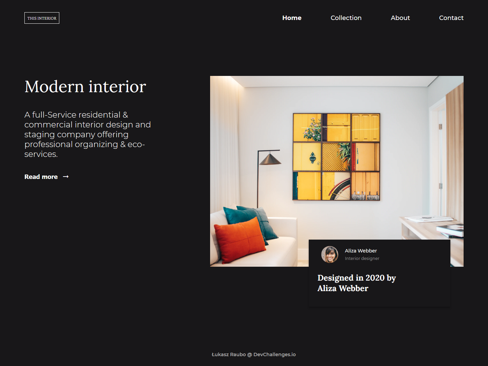

<!-- Please update value in the {}  -->

<h1 align="center">Interior consultant</h1>

   Solution for a challenge from  <a href="http://devchallenges.io" target="_blank">Devchallenges.io</a>.

  <h3>
    <a href="http://uninterested-maid.surge.sh/">
      Solution
    </a>
     | 
    <a href="https://devchallenges.io/challenges/Jymh2b2FyebRTUljkNcb">
      Challenge
    </a>
  </h3>

<!-- TABLE OF CONTENTS -->

## Table of Contents

- [Overview](#overview)
  - [Built With](#built-with)
- [Features](#features)
- [Contact](#contact)
- [Acknowledgements](#acknowledgements)

<!-- OVERVIEW -->

## Overview

- What was your experience?
This challenge had some tricky parts, e.g. mobile menu or that image on the background that took me some time to complete.
- What have you learned/improved?
This time i moved media query CSS to another file. I leared a bit about how to style checkboxes.
- Your wisdom? :)
There is still so much to improve my styling skills. I think that approach that I chose with background image was harder than it should be. Moreover, when I was styling footer with flexbox it was a bit easier.

### Built With

<!-- This section should list any major frameworks that you built your project using. Here are a few examples.-->

- [HTML]
- [CSS]
- [Material icons](https://material.io/resources/icons/?style=baseline)

## Features

<!-- List the features of your application or follow the template. Don't share the figma file here :) -->

This application/site was created as a submission to a [DevChallenges](https://devchallenges.io/challenges) challenge. The [challenge](https://devchallenges.io/challenges/Jymh2b2FyebRTUljkNcb) was to build an application to complete the given user stories:

- [x] User story: I can see a page following the given design
- [x] User story: On mobile, I can see a collapsed navigation
- [x] User story: On mobile, when I select the hamburger menu, I can see a navigation

## Acknowledgements

<!-- This section should list any articles or add-ons/plugins that helps you to complete the project. This is optional but it will help you in the future. For exmpale -->

- [Steps to replicate a design with only HTML and CSS](https://devchallenges-blogs.web.app/how-to-replicate-design/)
- [How to keep your footer where it belongs ?](https://www.freecodecamp.org/news/how-to-keep-your-footer-where-it-belongs-59c6aa05c59c/)
- [Pure CSS Hamburger Menu & Overlay](https://youtu.be/DZg6UfS5zYg)

## Contact

- GitHub [@RauboLuk](https://github.com/RauboLuk)
- Stack Overflow [@RauboLuk](https://stackoverflow.com/users/9185799/rauboluk)